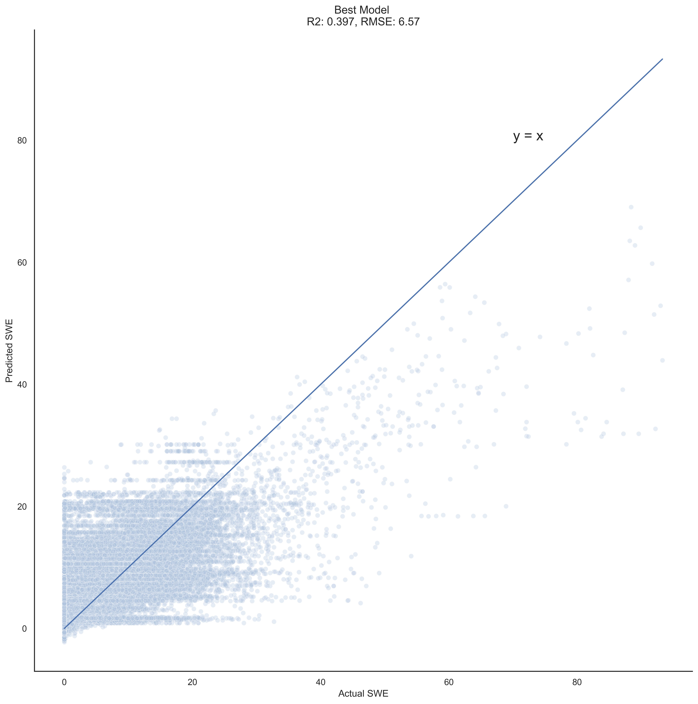

# Predicting Snow Water Equivalent in regions in Western United States
**Estimating snow water equivalent (SWE) at a high spatiotemporal resolution over the Western U.S. using near real-time data sources**

**Author**: Hanis Zulmuthi

May 2022


Source: [Reddit.com](https://www.reddit.com/r/EarthPorn/comments/a6ewla/snow_and_flowing_water_is_one_of_the_most_magical/?utm_source=ifttt)


## Overview
This project budded from a competition titled [Snowcast Showdown](https://www.drivendata.org/competitions/90/competition-reclamation-snow-water-eval/page/431/) on [Driven Data](https://www.drivendata.org/). The goal of the project is to develop a predictive model to estimate the distribution of Snow Water Equivalent (SWE) at a high spatiotemporal resolution over the Western U.S. using near real-time data sources.

## Introduction
Snow Water Equivalent (SWE) is a common snowpack measurement used by hydrologists and water managers to gage amount of liquid water contained within snowpack. It is equal to the amount of water contained within the snowpack when it melts. It can be thought of as the depth of water that would theoretically result if you melted the entire snowpack instantaneously [[1]](#1).  

Snow water reservoir is one of the main sources 

## Data Understanding
**Historical Ground Measures data:** Ground measures help provide regularly collected, highly accurate point estimates of SWE at designated stations. Ground measures data range from 2013-2019 and 2020-2021 was provided in [ground_measures_train_features.csv](./data/ground_measures_train_features.csv) and [ground_measures_test_features.csv](./data/ground_measures_test_features.csv). The ground measures data are from [Snow Telemetry (SNOTEL)](https://www.nrcs.usda.gov/wps/portal/wcc/home/) and [California Data Exchange Center (CDEC)](https://cdec.water.ca.gov/). The dataset used from these sources is available in this repo [here](./data/).

&nbsp;&nbsp;&nbsp;&nbsp;&nbsp;&nbsp;***[SNOTEL](https://www.nrcs.usda.gov/wps/portal/wcc/home/):*** The Snow Telemetry (SNOTEL) program consists of automated and semi-automated data collection sites across the Western U.S.

&nbsp;&nbsp;&nbsp;&nbsp;&nbsp;&nbsp;***[CDEC](https://cdec.water.ca.gov/):*** The California Data Exchange Center (CDEC) facilitates the collection, storage, and exchange of hydrologic and climate information &nbsp;&nbsp;&nbsp;&nbsp;&nbsp;&nbsp; to support real-time flood management and water supply needs in California. CDEC operates data collection sites similar to SNOTEL within &nbsp;&nbsp;&nbsp;&nbsp;&nbsp;&nbsp; California.

&nbsp;&nbsp;&nbsp;&nbsp;&nbsp;&nbsp;Ground-based sites from SNOTEL and CDEC are used both as an input data source and in ground truth labels for our predictive model. &nbsp;&nbsp;&nbsp;&nbsp;&nbsp;&nbsp;***Note that, sites that we are predicting SWE for, are entirely distinct from those in the features data.***

**[MODIS Satellite Imagery](https://microsoft.github.io/AIforEarthDataSets/data/modis.html):** The MODIS satellite images consist of MODIS/Terra and MODIS/Aqua Snow Cover Daily L3 Global 500m SIN Grid. Terra's orbit around the Earth is timed so that it passes from north to south across the equator in the morning, while Aqua passes south to north over the equator in the afternoon. Snow-covered land typically has very high reflectance in visible bands and very low reflectance in shortwave infrared bands. The Normalized Difference Snow Index (NDSI) reveals the magnitude of this difference. The snow cover algorithm calculates NDSI for all land and inland water pixels in daylight using MODIS band 4 (visible green) and band 6 (shortwave near-infrared).

The satellite imageries from MODIS were not used for modelling due to contraints in computing power and memory. We did however, pull down the satellite images from their [Azure blob]() and saved it as numpy arrays of pixels. This process was done in this [notebook](./src/MODIS-DEM-Preprocessing_colab.ipynb) that was executed in [Google Colab](https://colab.research.google.com/?utm_source=scs-index).


### Notebooks in this repo
[MODIS-DEM-Preprocessing_colab.ipynb](./src/MODIS-DEM-Preprocessing_colab.ipynb) - This notebook details the process of pulling down MODIS satellite imageries from Azure blob and save them as numpy arrays of pixels.

[MODIS-Preprocessing.ipynb](./src/MODIS-Preprocessing.ipynb) - This notebook details the same process as the above notebook but for local machines and using conda environment. The environment to run this notebook is provided in the repo [here](modis.yml). **However,** this notebook wasn't executed to completion due to restraints on computational memory on my local machine.

[Data-Preprocessing.ipynb](./src/Data-Preprocessing.ipynb) - This notebook is where the data processing of ground measures data into model features was done. It then saves the resulting dataframe for modeling. The environment to run this notebook is provided in the repo [here](geo_env.yml).

[EDA.ipynb](./src/EDA.ipynb) - This notebook contains time series data exploration of 

[Modeling.ipynb](./src/Modeling.ipynb) - This notebook contains dummy model, linear regression and 3 different types of Gradient Boosting models trained on the data saved at the end of Data-preprocessing notebook. This notebook also contains model evaluations and comparisons. The environment to run this notebook is provided in the repo [here](geo_env.yml). It is the same environment used for Data Processing notebook.

## Modeling & Results

### Model Target (predicted)
Our model is predicting snow water equivalent (SWE) measures for 2013-2021 for [1km x 1km grid cells](./data/grid_cells.geojson). For model training, we SWE values for 2013-2019 were provided in [train_labels.csv](./data/train_labels.csv). For model evalutation, data for 2020-2021 is in [labels_2020_2021.csv](./data/labels_2020_2021.csv). 

### Model Features (predictors)
***1. Ground measures Data (SNOTEL and CDEC)***

SWE values of the top 20 nearest (by distance) ground measure stations to the grid cell were used as model features.
 
***2. Geo-spatial features***

- Latitude
- Longitude
- Region type


### Model Comparison
We started off with our first simple model that returned an R2 of 0.09730. This will be our baseline, and yes, it's a pretty low baseline. Our subsequent models manage to beat the R2 of our first simple models as follows:


All models except CatBoost Regressor with the parameters Hypertune were ran using default parameters. The R2 is the mean of cross-validations R2. As seen in the figure above, our best model is a Catboost Regressor. The hypertuned CatBoost only improved by a mere 0.05. With all the models being around the same R2 range, it tells that the way to improve our R2 is to include more features that are more descriptive of the geolocation of the grid cell regions themselves and features that have influence on the yearly snow packs. And these features could be temperature, precipitation, elevation and satellite images.

### Best Model
#### CatBoost Regressor with hypertuned parameters
To reiterate, our best model is our CatBoost Regressor with some hypertuning. It gave a R2 value of 0.3977, the highest out of 5 and an RMSE of 6.57. For reference, an ideal RMSE would be in the range of 1-3. The best parameter setting that resulted in this R2 value is: 
```
{'catboost__depth': 10,
 'catboost__learning_rate': 0.1,
 'catboost__min_data_in_leaf': 10,
 'catboost__n_estimators': 100}
 ```
 The figure below is a visualization of our best model's performance.



We can see that our model with the input features wasn't able to capture the variation of SWE.

## Conclusion 

### Future Work

**1. Explore Time-Series to forecast SWE at SNOTEL and CDEC stations**

**2. Exploration of feature engineering**
  - Use historical mean for SWE? capture trends 
  - Data from snow day ? capture season
  - geospatial data

**3. Incorporate data from satellite imageries & remote sensing data**
  - Include Satellite imageries
  - Climate data
  - DEM 
  - MODIS Terra/Aqua Data 
mean and variance of pixel values over an entire grid cell.
Eliminate Modis data for a grid cell on days with high cloud cover (data becomes sparse)
5-day Rolling average of the mean pixel values
15-day Rolling average of the mean pixel values
DEM
Mean and variance of pixel values over an entire grid cell.
HRRR Climate Data

**4. Use near Real-time data to predict SWE**
  - Make a dashboard of predictions and forecast? Note that this means you may use approved data from both training and test periods from Stage 1 as training data for Stage 2 submissions. You will then use your model to make weekly predictions for 2022 for the grid cells identified in submission_format.csv.

## Repository Structure
  ```
├── data  
├── figures
├── models
├── src 
│       ├── catboost_info
│       ├── Data-Preprocessing.ipynb
│       ├── EDA.ipynb
│       ├── MODIS-DEM_Preprocessing_colab.ipynb
│       ├── MODIS-Preprocessing.ipynb
│       └── Modeling.ipynb
│
├── .gitignore
├── geo_env.yml
├── LICENSE
├── README.md
└── modis.yml 
  ```

## References
<a id="1">[1]</a> 
What is SWE?
(Natural Resources Conservation Service Nevada, [USDA](https://www.nrcs.usda.gov/wps/portal/nrcs/detail/nv/snow/?cid=nrcseprd1746821#:~:text=Snow%20Water%20Equivalent%20(SWE)%20is,the%20snowpack%20when%20it%20melts.))
